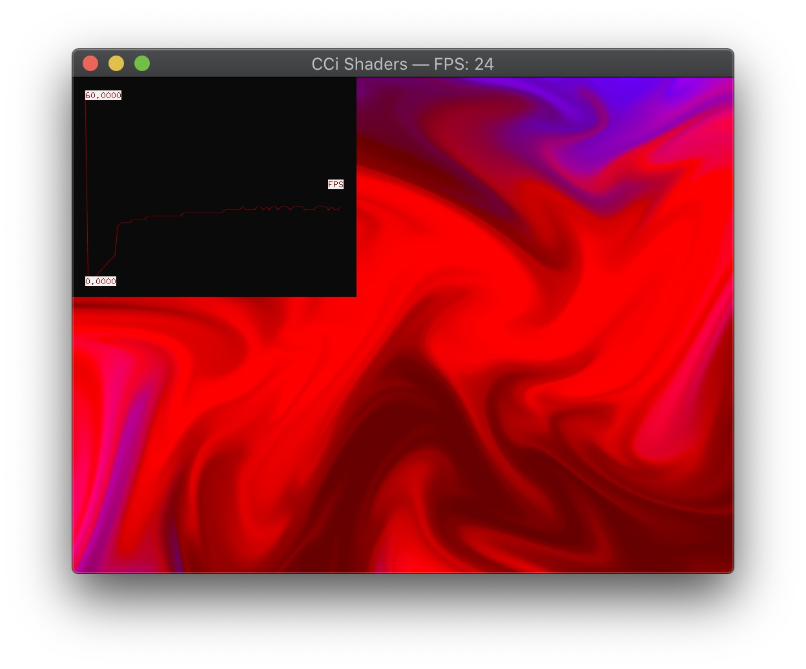
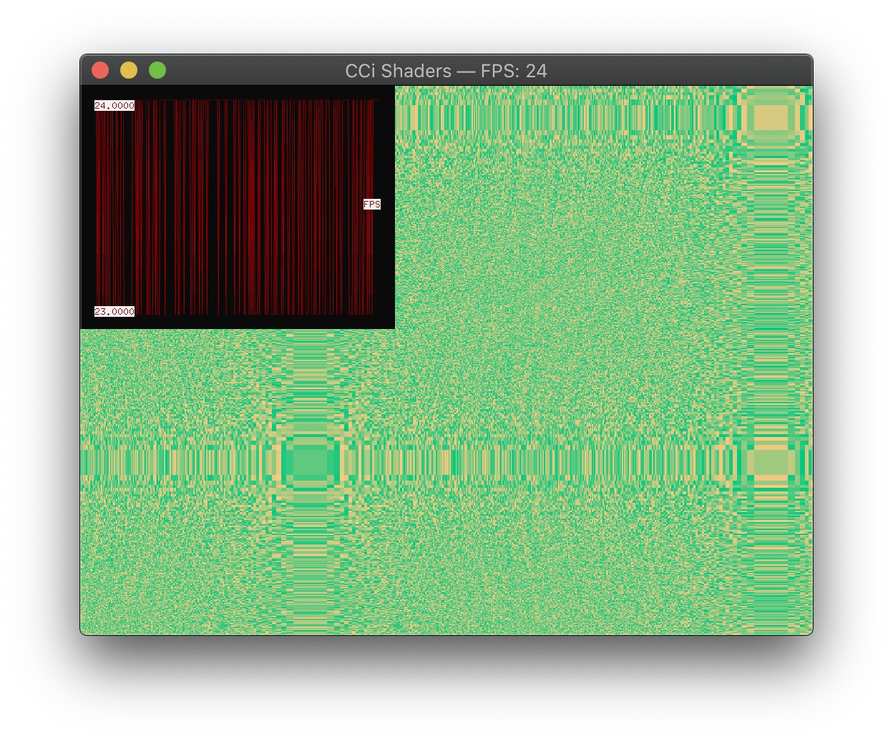
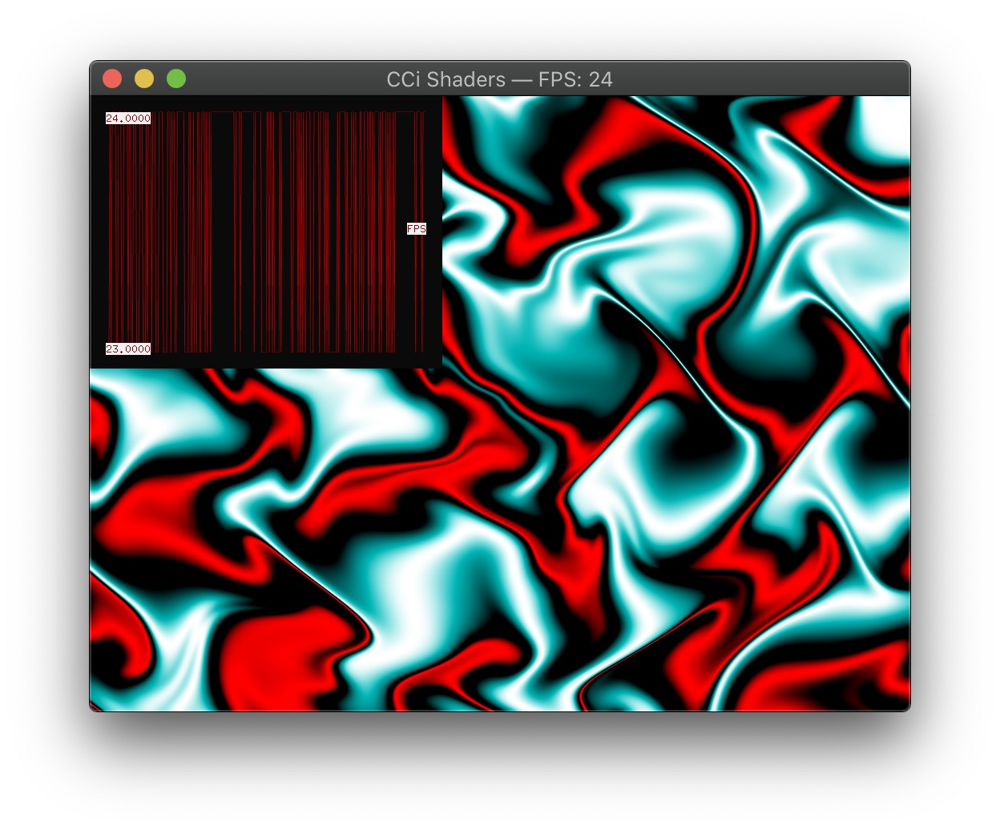

 # Week 2 Exercise - Your first OF project
 
 - Select a JavaScript project you completed last term and port it to C++ using openFrameworks

## Setup

There is a build in the `build/bin/` directory. To run the app, simply double click on the icon.

To set up the development environment on mac, make sure to have downloaded the OF library, then import the project using the OF project manager. Be sure to have `ofxPlotter` and `ofxShader` selected, then click update. When successfully updated, a dialog will prompt you to open the project in the Xcode IDE.  

## Log

I used this as part of our tate exhibition, displaying the class's shaders. For this, I created a loop that iterates every x frames. Josh later added his vertex shaders, as well as shaders that made use of the webcam. Since most of our class shaders weren't interactive, I decided to add a fps HUD using `ofxPlotter`. This graphs the fps count, emphasizing that shaders weren't prerecorded and in–fact real time. Unfortunately, setting the plugins ceiling and floor values didn't work, which adjusted the fps axis to 23 and 24, creating more of a zigzag artwork than anything else. The developer didn't react to the Github issue I opened.

This version is a simplified version, only showcasing my own fragment shaders. Therefore, I've removed the webcam and vertex code blocks. 

Tip: Unlike processing's `pixelDensity()` function, OF doesn't create a retina capable window by default. Setting `High Resolution Capable` to `YES` in `openFrameworks-Info.plist` enables retina support – took me years to find out. Very handy.
