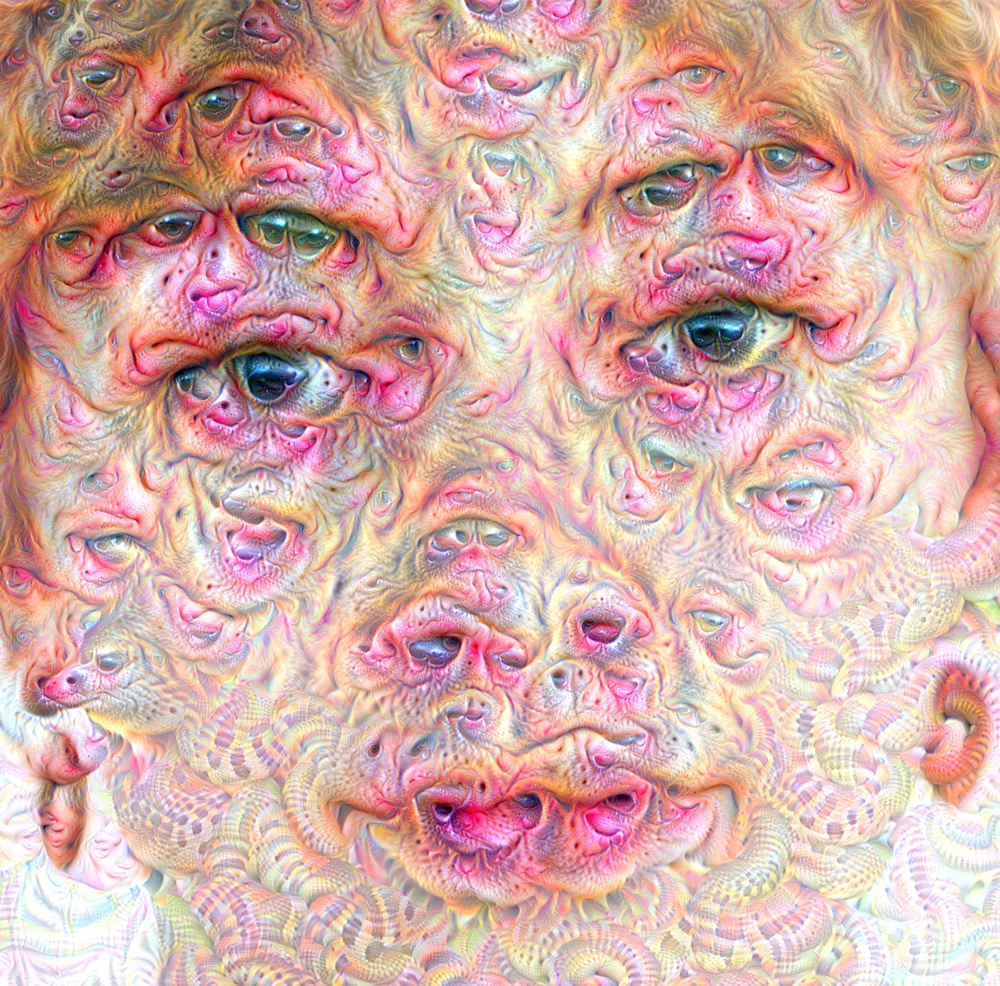
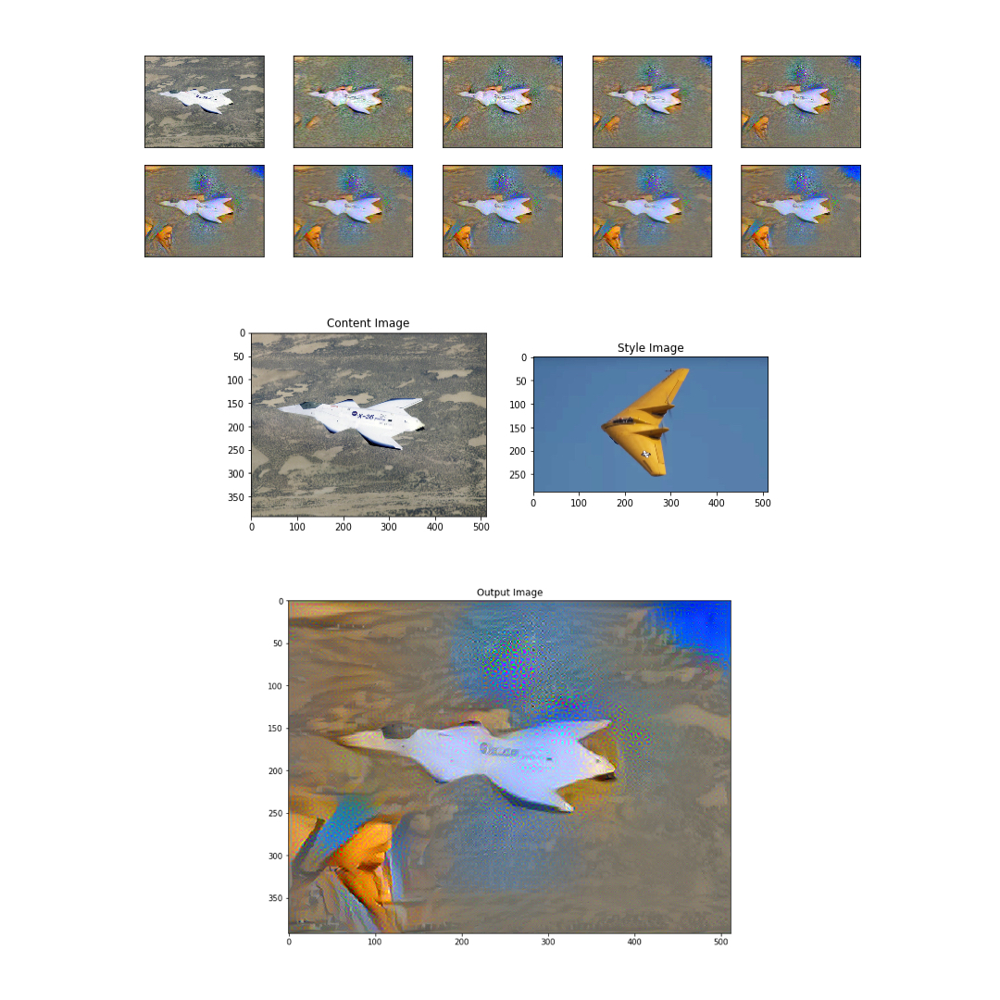
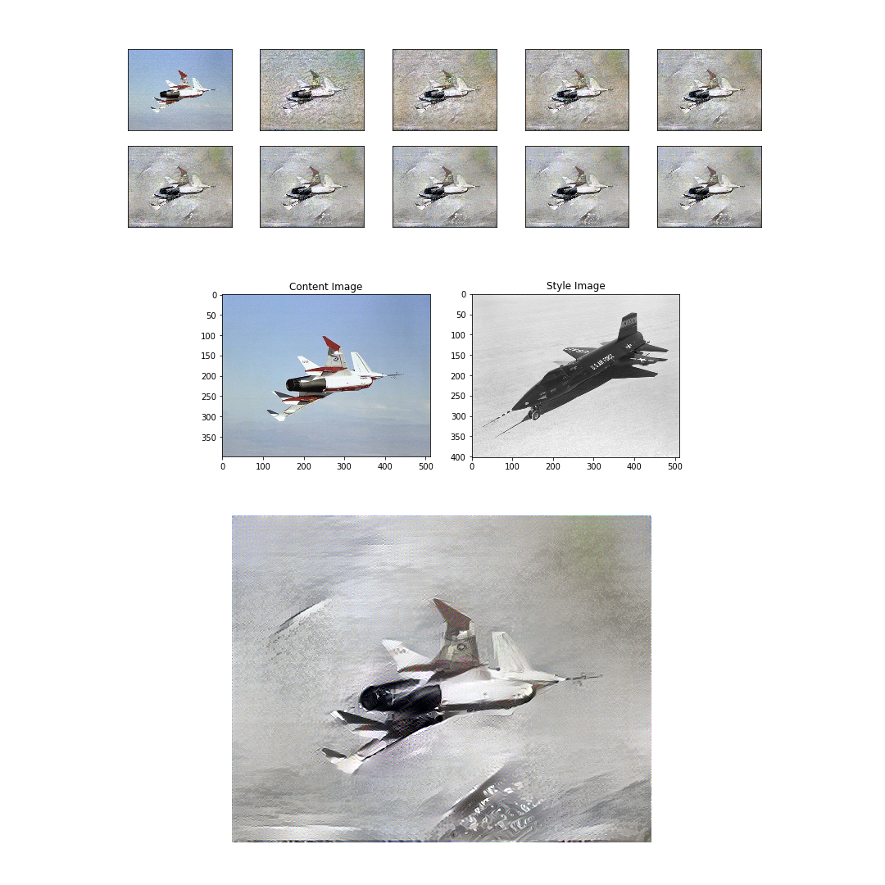

# Using TensorFlow to Create Outputs

**Apart from setting up logistics in Colab, I did not adapt the model itself.**

## Installation

All python notebooks are located within their respective folders. I use Google Colab to run them because its faster and it takes care of installing all the dependencies for me. For the sake of this lab, I have created a pip file that lets you install the dependencies by running `pipenv install`. Here's a [link](https://stackoverflow.com/questions/47295871/is-there-a-way-to-use-pipenv-with-jupyter-notebook) to how to make pipenv compatible with jupyter notebook. The script can be executed by running `pipenv run jupyter notebook ./route-to-file.ipynb`.

## Deep Dream

Source: https://research.google.com/seedbank/seed/deepdream

This has been a little bit of a primer for my final project. The Seedbank example is basically plug and play when used with Colab – no changes needed to get running. As with some other examples, I used colabs handy feature to connect to my Google Drive, which enables me to save to it directly. I can also pull in my dataset from my drive:

```python
from google.colab import drive
drive.mount('/content/drive')
```





## Style Transfer

Source: https://research.google.com/seedbank/seed/neural_style_transfer_with_tfkeras

### Fighterplane

I'm intrigued by fighter planes, which shows to prove that I'm still a little boy, really. Joel Gethin Lewis seems to share the same fascination, as his instagram (https://www.instagram.com/jgl/) is littered with experimental fighter aircraft up until January of 2018. Inspired, I collected images of said, stuck them into the seedbank algorithm, and out came experimental fighterplane style transfers. I figured that it's very easy to run into copyright issues when assembling ones own database using images from google.






### Aerial Pics

This time I used my own images. Conveniently, I had a lot of photographs of landscapes I took out of plane windows – I travel a lot. The landscapes in the images are always different but the photographs themselves are somewhat similar in format, which makes them adequate for training a model on them. I am happy with the abstract nature of these results. One specifically looks like a minimap of Age of Empires, whereas another resembles an expressionist painting. 

Technically, I used a similar approach to the first time. I did experiement with the amount of iterations, whereas this didn't create more interesting results. Yes, the style transfer looked more accurate but the latent space is whats truly interesting, something you can accomplish within a few iterations. As opposed to fetching images straight from URLs, I hooked up my Google Drive to Colab (very handy) and saved my output straight to a folder in the cloud. I prefer working with static images when collecting my own set of inputs, as its easier to organize and archive later on.


