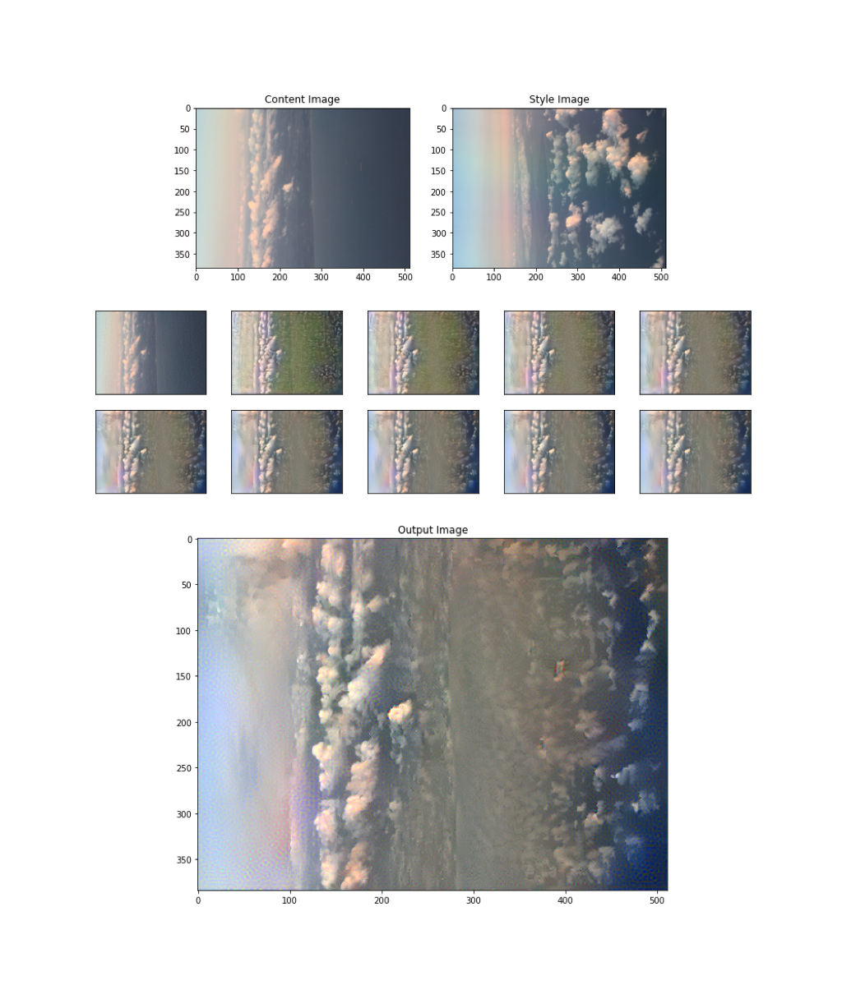

# Week 7 Exercise - Using TensorFlow to create outputs

- Have a look at the following demos:
- https://research.google.com/seedbank/seed/neural_style_transfer_with_tfkeras
- https://research.google.com/seedbank/seed/deepdream
- Use your own images to create your own style transfer and deep dream outputs.
- Submit your image outputs. If you make any changes to the code, submit your own version of the notebooks, highlighting the changes you made using comments.
- You should also try to get the code running on your own machine. If you do this, submit the code that runs on your own device.

## Deep Dream

## Style Transfer

### Aerial Pics

Images I took from the plane

Removed the image download

Set up google drive access

Added static images

Set iterations to 5000

### Fighterplane

