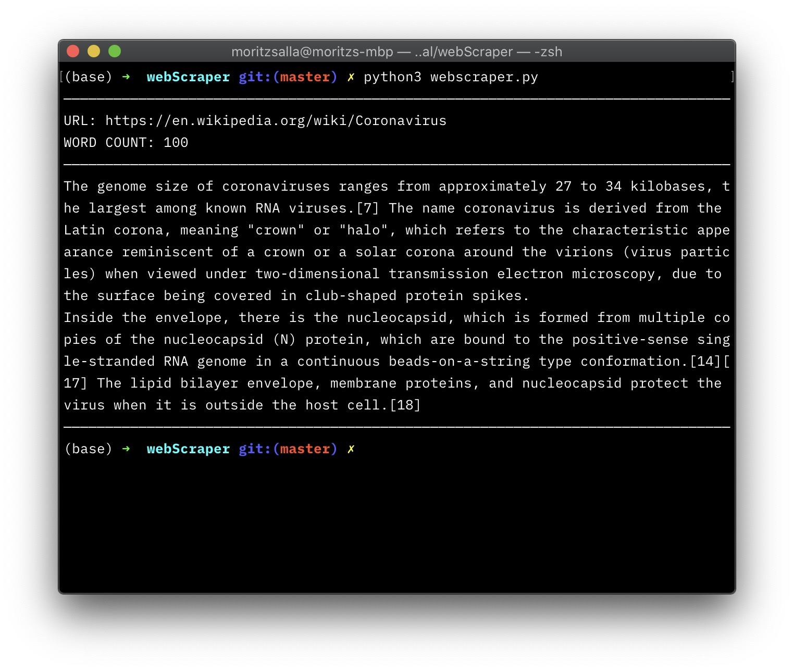
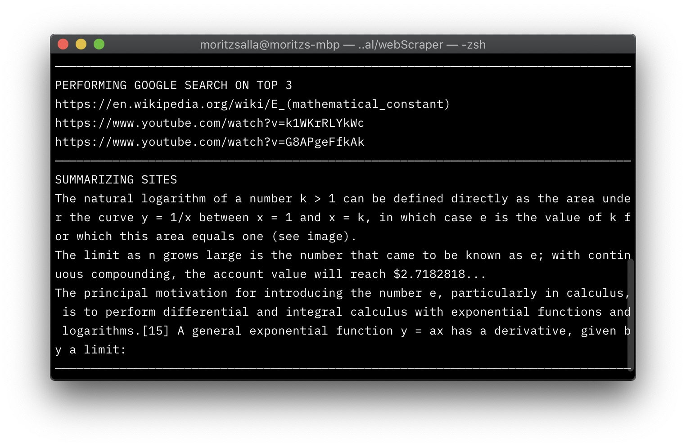

# Python Webscrapers

## Installation

### Basic Version

I've kept the simple website summarizer because I think its so useful! I've even turned it into a terminal command that I can use whenever I need it. 

This project uses pipenv. To install the dependencies, run 

```
pipenv install
```

To run this programm in your terminal, use this command:

```
pipenv run python3 webscraper.py
```

The program will prompt you with two fields that you have to fill out, the URL and the WORD COUNT. After having entered your information, the summarized text will be displayed.



### Extended Version

This program extracts keywords from a site and ranks them in popularity. The three most common keywords are then used as queries to search for new sites. These, in return, will be summarized. Unlike the first version, the URL is statically set in the code.

If you haven't already, install the dependencies like so:

```
pipenv install
```

Then run:

```
pipenv run python3 webscraper-ext.py
```




## Summary

Setting up my python environment is a nightmare. Conda won't install some dependencies, global pip packages to the rescue. I don't know what's local and what's global since there's no package file anywhere. I've looked into Docker, and it looks neat but for another day when I have more time at hand. I'm specifically struggling with python's requirements.txt file. I understand that `pip freeze` will copy the dependencies of your environment into a requirments.txt file. These seem to include many more sub-dependencies, as they are more than what I have installed. I have added a dependency manually because I couldn't be bothered to set up an environment. I hope this doesn't create errors for other users when installing the file.

Note: I've settled for `pipenv`, which I quite enjoy! It's only causing three quarters of the headache. Pipenv somewhat shares resemblance to the node package manager. But god is it slow. 

BeautifulSoup and Gensim are a delight. Since I have some knowledge in web development, the API for fetching a URL and skimming across HTML tags is very straightforward. Gensim keywords are already sorted—what a delight! The second scraper threw me off a little when I dealt with several requests at once. Instead of performing most operations within a single for loop, I, therefore, chose to write the results to an array. Since I'm calling the same functions (fetch url, beautify it, spit out clean p tags) twice, it would be a good idea to encapsulate this in a function, therefore not to repeat myself.
