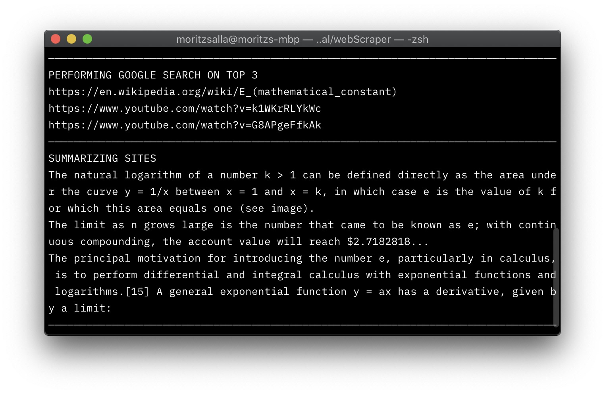

# Week 4 Exercise - Python webscrapers

- Build a simple webscraper that scrapes a set of documents from the internet and summarises them using gensim.
- If you manage to achieve this, extract keywords from all the different documents and see if any are more popular than others.
- Search for documents that contain those keywords using Python and then summarise those documents too.

### Basic Version

To install all dependencies, cd into the downloaded folder and run this terminal command.

```
pip install -r requirements.txt
```

To run this programm in your terminal, use this command:

```
python3 webscraper.py
```

The program will prompt you with two fields that you have to fill out, the URL and the WORD COUNT. After having entered your information, the summarized text will be displayed.


### Extended Version

This program extracts keywords from a site and ranks them in popularity. The three most common keywords are then used as queries to search for new sites. These, in return, will be summarized.

Unlike the first version, the URL is statically set in the code.

```
python3 webscraper-ext.py
```





### Summary

I've kept the simple website summarizer because I think its so useful! I've even turned it into a terminal command that I can use whenever I need it. 

gensim keywords are already sorted. what a delight
